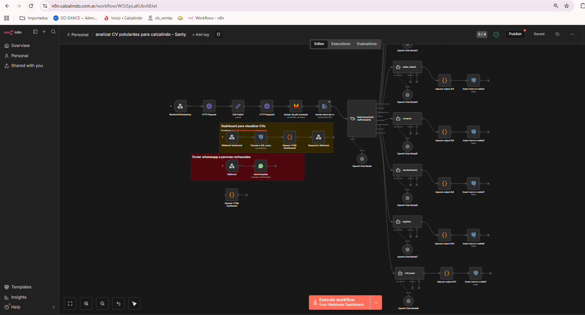
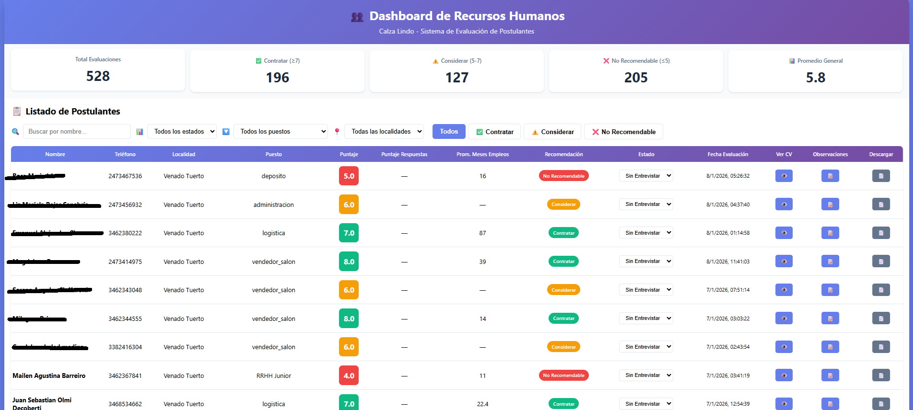
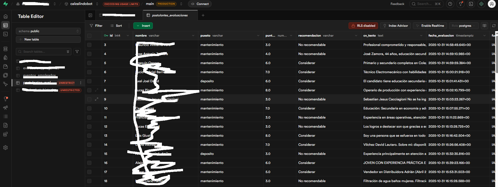

# Análisis Automático de CVs – Postulantes CalzaLindo (n8n)

## Descripción general

Esta automatización corresponde a un **workflow de n8n para el análisis automático de CVs de postulantes**, orientado a procesos de selección internos de **CalzaLindo**.

El objetivo del flujo es **recibir CVs de candidatos**, analizarlos mediante **IA**, extraer información relevante, evaluar su adecuación al puesto y generar un **resumen estructurado** que facilite la toma de decisiones del área de RRHH.

El proyecto está pensado como una **herramienta de preselección**, no como un sistema definitivo de contratación.

Workflow cv postulantes

postulantes dashboard

BD supabase

---

## Objetivo del workflow

- Recibir CVs de postulantes de forma automatizada.
- Analizar contenido del CV usando IA.
- Extraer datos clave del candidato.
- Evaluar compatibilidad con el perfil buscado.
- Generar un resumen claro y estandarizado.
- Reducir tiempo manual de revisión de CVs.
- Centralizar evaluaciones en un único flujo.

---

## Tecnologías utilizadas

- **n8n** (orquestador)
- **OpenAI (GPT-4.1-mini)** vía LangChain
- **Webhooks HTTP** para recepción de CVs
- **JavaScript (Code Nodes)** para normalización
- **PostgreSQL / Base de datos** para persistencia (opcional)
- **Archivos PDF / Texto** como input

---

## Flujo general de la automatización

### 1. Ingreso del CV
- Nodo: `Webhook`
- Permite recibir:
  - CV en PDF
  - Texto plano
  - Información estructurada del postulante
- Cada ejecución corresponde a un candidato.

---

### 2. Preprocesamiento del contenido
- Nodo: `Code`
- Función:
  - Limpia texto del CV
  - Elimina caracteres innecesarios
  - Unifica formato
  - Prepara el contenido para el análisis con IA

---

### 3. Análisis con IA
- Nodo: `AI Agent`
- Rol: analista de RRHH
- Evalúa:
  - Experiencia laboral
  - Habilidades técnicas
  - Habilidades blandas
  - Estabilidad laboral
  - Adecuación general al puesto
- Devuelve una respuesta estructurada en formato JSON.

---

### 4. Normalización de salida
- Nodo: `Code`
- Garantiza:
  - JSON válido
  - Campos consistentes
  - Texto legible
- Corrige errores frecuentes del modelo.

---

### 5. Resultado final
El flujo genera un resumen con:

- Nombre del candidato
- Experiencia relevante
- Fortalezas detectadas
- Debilidades o alertas
- Nivel de adecuación al puesto
- Recomendación general (continuar / descartar)

---

## Estructura de salida (ejemplo)

- Datos del postulante
- Resumen ejecutivo del CV
- Evaluación cualitativa
- Recomendación final

---

## Limitaciones conocidas

- Dependencia total del contenido del CV.
- No valida veracidad de la información.
- Prompt hardcodeado.
- No hay ranking automático entre candidatos.
- Sin scoring numérico estandarizado.
- Sin control de duplicados.
- No hay interfaz gráfica dedicada.

---

## Valor del proyecto

- Automatiza una tarea repetitiva de RRHH.
- Estandariza la primera evaluación.
- Reduce sesgos manuales iniciales.
- Sirve como filtro previo a entrevistas.
- Integra IA de forma práctica en procesos reales.

---

## Posibles mejoras futuras

- Implementar scoring numérico configurable.
- Ranking automático de candidatos.
- Persistencia histórica por postulante.
- Comparación entre múltiples CVs.
- Dashboard de visualización.
- Integración con email o ATS.
- Control de versiones de prompts.

---

## Estado actual

🟢 Funcional  
🟡 Uso interno  
🔵 En evolución  

---

**Autor:** Santiago Perez Kay  
**Contexto:** Automatización de análisis de CVs con IA desarrollada en n8n
